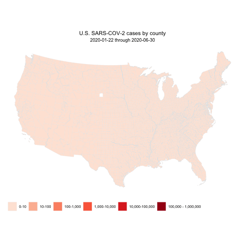

# Animated visualization of U.S. covid data

The notebook *covid_viz.Rmd* shows how to make an **animated chloropleth** of U.S. county-level confirmed covid cases. All necessary data is included in this repo and necessary R package dependencies are listed in the notebook. 

## Data sources
- [Johns Hopkins' CSSE COVID data](https://github.com/CSSEGISandData/COVID-19) 
- [US county map geo data](https://github.com/kjhealy/us-county)

## Helpful resources
- Graphing chloropleths in R: [Data Visualization](https://socviz.co/maps.html)
- Making animated graphs in R: [gganimate package](https://gganimate.com/articles/gganimate.html)

